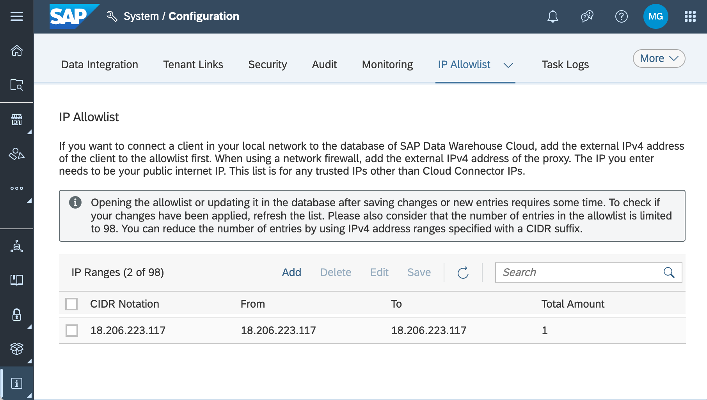

# SAP Data Warehouse Cloud Provisioner

## Table of Contents
* [1.0 - Description](#description)
* [2.0 - Requirements](#requirements)
  * [2.1 - Required Setup](#required-setup)
  * [2.2 - Optional Setup](#optional-setup)
* [3.0 - Check your environment](#check)
  * [3.1 - Python](#check-python)
  * [3.2 - Git](#check-git)
  * [3.3 - SAP HANA configuration](#hana)
* [4.0 - Download and Configuration](#download)
* [5.0 - Provisioner Configuration](#config)
* [6.0 - Command Syntax](#syntax)
* [7.0 - Examples](#example)
* [8.0 - Errata](#errata)
  * [8.1 - Known Issues](#issues)
  * [8.2 - ]
## <a href="#description"></a>1.0 Description
This sample tool is an example of how to programmatically create, update and delete SAP Data Warehouse Cloud artifacts. The tool, referred to as **provisioner**, is written in Python and demonstrates how to automate various SAP Data Warehouse Cloud provisioning activities. The **provisioner** can perform the following actions against SAP Data Warehouse Cloud tenants:
- create and remove spaces with a simplified command line
- bulk create and remove spaces using a CSV file
- create and remove connections in one, or many spaces
- create and remove shared objects from one space to another
- create scripts of multiple commands
- generate a set of HANA tables for analytics

## 2.0 - Requirements
Before running the **provisioner**, the following configurations and 3rd party components must be available.
### 2.1 - Required
- SAP Data Warehouse Cloud administrator access, i.e., user with <span style="color: green">**DW&nbsp;Administrator**</span> privilege
- [Python version 3.8](https://www.python.org/downloads "Download") or higher
### 2.2 - Optional
- [Git (latest version)](https://git.com "Download")
- Access to an SAP HANA (on-prem or cloud) schema
### 2.3 - Development
- [Node (latest version)](https://nodejs.com/en/download)
- [SAP @sap/dwc_cli](https://www.npmjs.com/package/@sap/dwc-cli)

## 3.0 Check your environment
To ensure success when running this tool, please use the following steps to validate the software requirements have been met.
### 3.1 - Python
The tool requires Python 3.8 (or higher) to be available.  Use the following command to verify the Python installation.

><span style="color: gray">_Note_: the latest versions of Python include both <span style="color: white">_python_</span> and <span style="color: white">_python3_</span> commands.</span>

```
ubuntu@ip-17-1-3-11:~$ python --version
Python 3.10.4
ubuntu@ip-17-1-3-11:~$
```
### 3.2 - Git
To retrieve the **provisioner** from GitHub, the command line version of Git is an easy way to download the project to a local directory. The project may also be downloaded from GitHub using a browser.

```
C:\>git --version
git version 2.37.0.windows.1

C:\>
```
## 4.0 - Download and Installation
Clone or download this repository to a directory. In all the examples in this README, a directory named "tools" will be used as the starting location for all operations.

The commands to download the project are similar for all major operating systems, i.e., Linux, Windows, and Mac OS X.

### 4.1 - Download
The **provisioner** is available on the SAP-samples Github repository: [DWC Provisioner](https://github.com/SAP-samples/dwc-provisioner).  The tool can be downloaded as a zip file from Github or the tool can be cloned directly from Github using one of the following commands.
#### Ubuntu Linux
From the home directory of the user _ubuntu_:
```bash
ubuntu@myhostname:~$ mkdir tools
ubuntu@myhostname:~$ cd tools
ubuntu@myhostname:~/tools$ git clone https://github.com/SAP-samples/dwc-provisioner
```

#### Windows
Open a command window (cmd):
```bash
c:\> mkdir c:\tools
c:\> cd c:\tools
c:\> git clone https://github.com/SAP-samples/dwc-provisioner
Cloning into 'dwc-provisioner'...
```
#### MacOS
From a terminal session:
```bash
myuser@mymachine ~ % mkdir tools
myuser@mymachine ~ % cd tools
myuser@mymachine tools % git clone https://github.com/SAP-samples/dwc-provisioner
Cloning into 'dwc-provisioner'...
myuser@mymachine tools % 
```
#### 4.2 - Optional Python setup
Python allows you to create "virtual environments" to help manage dependencies between installed packages and the versions of packages used in a specific project.  <span style="font-weight: bold; color: green">It is a best practice</span> to create a virtual environment for each project.  Without a virtual enviroment, all Python packages are installed in the "global" space and all projects share the same package versions.
>https://packaging.python.org/en/latest/guides/installing-using-pip-and-virtual-environments/

#### 4.2.1 - Install the Python virtual environment tool.
##### Ubuntu
```bash
sudo apt install python3-venv
```
##### Windows/MacOS
```
python -m pip install --user virtualenv
```
### 4.2.2 - Configure a virtual environment
Python virtual environments must be explicity created and activated.  The following command create a Python virtural environment in the provisioner 

<pre>
ubuntu@ip-17-1-83-11:~/tools$ cd dwc-provisioner
ubuntu@ip-17-1-83-11:~/tools/dwc-provisioner$ python3 -m venv .venv
</pre>
### 4.2.3 - Activate the virtual environment
<pre>
ubuntu@ip-17-1-83-11:~/tools/provisioner$ source .venv/bin/activate
(.venv) ubuntu@ip-17-1-83-11:~/tools/provisioner$ 
</pre>
Notice the (.venv) prefix to the command line.
c:\devpath\dwc-provisioning> python -m venv .venv
```

Activate the python virtual environment:
```bat
c:\devpath\dwc-provisioning> .venv\scripts\activate
```

If the environment is activated correctly, a previx (.venv) is shown in the command line:
```bat
(.venv) c:\devpath\dwc-provisioning>
```


### 4.3 - Install the required Python packages:
```bat
(.venv) c:\tools\provisioner> python -m pip install -r requirements/core.txt
```

### 4.4 - Configure HANA allow list (optional)
To create and store information about SAP Data Warehouse cloud information in an SAP HANA Cloud instance, ensure the IP address where this tool runs is in the allow list for SAP HANA Cloud connections.  In the example below, an SAP Data Warehouse Cloud Data Access User (a.k.a., hash-tag (#) user) is the target so in SAP Data Warehouse Cloud set the IP Allow list under the System / Configuration tab.



## 5.0 - Provisioner Configuration
Before using this tool, a configuration file must be you must set the identify the target tenant and set the username and password values.
```
c:\> cd tools\dwc-provisioner
c:\> .venv\scripts\activate
(.venv) c:\tools\dwc-provisioner> provisioner config
  --dwc-url https://{your-tenant}.{ds}.hcs.cloud.sap
  --dwc-user user.name@domain.com
  --dwc-password NotYourPassword!
```
Note: command 

To use the provisioner, credentials for SAP Data Warehouse Cloud and optionally for a HANA schema.

## 6.0 - Command Syntax<a href=""></a>
The provisioner tool accepts the following commands:
|Command|Description|
|-------|-----------|
|config|Set the environment configuration|
|users|User actions against the tenant, including list, create, and delete|
|spaces|Create, delete and list spaces.  This includes bulk loading and member assignment|
|shares|Create, delete and list objects shared to other space(s)|
|connections|Create, delete and list connections in one, or more spaces|

### 6.1 Command: config
This command saves connection information for both an SAP Data Warehouse Cloud tenant and optionally an SAP HANA Cloud (or on-premise) database.  After running this command, a new configuration file names <span style="color: green">**config.ini**</span> is created in the current working directory.
>Note: the **config** command does not validate the tenant or SAP HANA configuration values.

|Parameter|Values|
|---------|------|
|--config|Configuration file name (optional)|
|--logging|Generate logging message, options: info, debug|
|--dwc-url|Target SAP Data Warehouse Cloud tenant|
|--dwc-user|User name with administrative privileges on the tenant|
|--dwc-password|Password for the user specified in the --dwc-user parameter|
|--hana-host|HANA host name|
|--hana-port|HANA port|
|--hana-user|HANA username|
|--hana-password|HANA password|
|--hana-encrypt|Include the option to encrypt SAP HANA communications (default=False)|
|--hana-sslverify|Validate the HANA certificate (default=False)|

**Examples**:
1. Set the configuration for the SAP Data Warehouse Cloud tenant:

```
(.venv) c:\tools\dwc-provisioner> provisioner config 
    --dwc-url https://notarealtenant.us10.hcs.cloud.sap
    --dwc-user not.a.real.user@dummy.sap
    --dwc-password NotARealPassword!
```

After running this command, the config.ini file has the following content:

```
(.venv) c:\tools\dwc-provisioner> type config.ini
[dwc]
dwc_url = https://mytenant.us10.hcs.cloud.sap
dwc_user = not.a.real.user@dummy.sap
dwc_password = eJwLz8vxDDT0M04xMDFKzPE0BQAqfgTD
```

>Note: password values never appear in plain text.

2. Set both the SAP Data Warehouse Cloud and Data Access user credentials.  This example connects to the SAP Data Warehouse Cloud tenant and a Data Access User named PROVISIONER define in the space ADMINSPACE, i.e., ADMINSPACE#PROVISIONER.

```(.venv) c:\tools\provisioner> provisioner config
    --dwc-url https://notarealtenant.us10.hcs.cloud.sap
    --dwc-user not.a.real.user@dummy.sap
    --dwc-password NotARealPassword!
    --hana-host 9dc97f57.hana.prod-us10.hanacloud.ondemand.com
    --hana-port 443
    --hana-user ADMINSPACE#PROVISIONER
    --hana-password notMyPassword 
    --hana-encrypt
```
### 6.3 - Command: users
The users command can list, create, and delete users from an SAP Data Warehouse Cloud tenant.
#### 6.3.1 - Command: users list
The **users list** command retrieves user information from the SAP Data Warehouse Cloud tenant.
|Parameter|Description|
|---------|-----------|
|-f, --format|output style: 'hana', 'csv', 'json', 'text' - default=text|
|-p, --prefix|prefix for output, default="DWC_USERS"|
|-s, --search|seach user names or emails on substring (default = false)|
|-d, --directory|directory for output|
|userName|user name(s) to list, separated by spaces|

**Examples:**
1. List all the users in the tenant.
```
users list
```
2. List all the user and output the information in CSV format to the specified output directory.  The file names will be DWC_USERS.csv and DWC_USERS_role_members.csv.
```
users list -f csv -d c:\temp
```

3. Search the users in the tenant for any users with "sap.com" appearing anywhere in their definition (including email), as well as any user with the word "greynolds" in their definition.

```
users list -S sap.com greynolds
```

6.3.2 - Command: users create

*Work in progress*

6.3.3 - Command: users delete

*Work in progress*

### 6.2 - Command: spaces
The spaces command can create, delete and list spaces in the tenant.
### Command: spaces list
The **spaces list** command queries the SAP Data Warehouse Cloud tenant for details for all spaces, specific spaces, or substring search of available spaces.  If no names are provided, all spaces in the tenant will be included.  For each name listed, the "spaces list" command can perform a substring search based on name matches.  For instance, adding the **--search** flag and the space name "TRAINING" finds spaces with names such as "TRAINING_BOB", "FINANCE_TRAINING", and "HRFINANCE".

|Parameter|Description|
|---------|-----------|
|spaceName|space name(s) to list|
|-f, --format|output style: 'hana', 'csv', 'json', 'text'|
|-p, --prefix|prefix for output, default="DWC_SPACES"|
|-s, --search|seach space names on substring (default = false)|
|-d, --directory|filename for output|

### Command: spaces create
|Parameter|Description|
|---------|-----------|
|--label | optional label to assign - defaults to spaceId|
|-t, --template | Space name to use as a template|
|-d, --disk | Disk allocated to space|
|-m, --memory | Memory allocated to space|
|-f, --force | force the re-creation if space exists|
|spaceName | space name to create|
|users | users to add to the space|

### Command: spaces delete
|Parameter|Description|
|---------|-----------|
| spaceName | space name(s) to create |

### Command: spaces bulk
Space Id,Label,Disk,Memory,Template,Force,User 1,User 2,User 3,etc
#### Command: spaces bulk create
|Parameter|Description|
|---------|-----------|
|-s, --skip | header lines to skip in the CSV file, default="1" |
|-f, --force | force the re-creation if space exists |
|-t, --template | Space name to use as a template |
|filename | CSV file containing spaces to create |


#### Command: spaces bulk delete
|Parameter|Description|
|---------|-----------|
|-s, --skip | header lines to skip in the CSV file, default="1" |
|filename | CSV file containing space names to delete |

### Command: spaces members
#### Command: spaces member add
#### Command: spaces member delete
### Command: shares
### Command: connections
## Creating SAP Data Warehouse Cloud artificats ##
Commands:
- config
- script {filename}
- users list 

- spaces create
- spaces delete
- spaces list
- spaces bulk create
- spaces bulk delete

- connections list
- connections create
- connections delete

- shares create


To uninstall run the following command:

## Known Issues
This is an example application in an early stage of development, so
- don't store personal information because of missing access logging
- don't store sensitive information because there is no access control
- don't use the example application productively because users and passwords generated by the **config** command, while obfuscated, are not securely encrypted.
- don't expect always meaningful error messages in reaction to erroneous input.


## How to obtain support
This is an example application and not supported by SAP. However, you can 
[create an issue](https://github.com/SAP-samples/<repository-name>/issues) in this repository if you find a bug or have questions about the content.
 
For additional support, [ask a question in SAP Community](https://answers.sap.com/questions/ask.html).

## Contributing
If you wish to contribute code, offer fixes or improvements, please send a pull request. Due to legal reasons, contributors will be asked to accept a DCO when they create the first pull request to this project. This happens in an automated fashion during the submission process. SAP uses [the standard DCO text of the Linux Foundation](https://developercertificate.org/).

## Code of Conduct
see [here](CODE_OF_CONDUCT.md)
## License
Copyright (c) 2022 SAP SE or an SAP affiliate company. All rights reserved. This project is licensed under the Apache Software License, version 2.0 except as noted otherwise in the [LICENSE](LICENSE) file.
